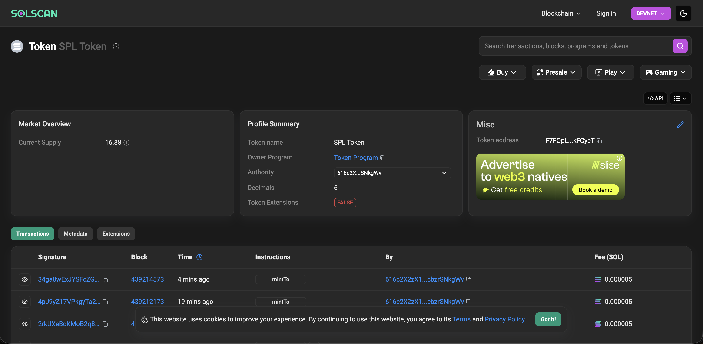

# Solana SPL Token Mint (Devnet)

This task demonstrates the creation of an SPL Token on **Solana Devnet**, along with minting tokens to an Associated Token Account (ATA) using `@solana/web3.js` and `@solana/spl-token`.

---

## Token Overview

- **Network:** Solana Devnet  
- **Token Standard:** SPL Token  
- **Decimals:** 6  
- **Mint Address:**  
  `F7FQpLCoGpb7BXXqutB1t8YdPzNpTmAx3QfBAykFCycT`

The mint was created programmatically, and tokens were minted directly into the creator’s Associated Token Account (ATA).

---

## Minting Transaction

Tokens were successfully minted using the SPL Token `mintTo` instruction.

- **Mint Transaction Hash:**  
  `4pJ9yZ17VPkgyTa2KTC6CRg6oNqrFTKd78NkJHKDTjCY4J1o5SoX4FBhjeAfn7bfX5QkM28bJ67QAabUQejKpt7F`

- **Associated Token Account (ATA):**  
  `Da8HFUxVnaPBtkrj5nJPRBdmkHum3Pa2xDnZPkGpJ4RM`

---

## Token Screenshot

Below is a screenshot showing the token and minted balance on Solana Devnet (via Explorer or wallet view):

> 📸 **Screenshot:**  
> 

---

# NFT Mint & Trade

## NFT: OkiCat

- **Name:** OkiCat
- **Symbol:** OKC
- **Description:** I should maybe get a cat

---

## Minting Transaction Hashes

| Step | Transaction / Address |
|---|---|
| Mint Address | `FQ1b5E6wRaG7My88fVGFbqpX2SHYzapEs39Sk7TF1Zng` |
| Mint TX | [`3TokjR5...GNXqN`](https://explorer.solana.com/tx/3TokjR5KeV9CqVV1Uy2HoVfDdRzUy9VuLcvn4mo1GMK1Z6F2zX5ekXEwAHjhg9FLvaEuMYzDaWdgcZR6gLxGNXqN?cluster=devnet) |
| Image URI | [Arweave](https://gateway.irys.xyz/8qCrnrZh4WZQbFyV4hK9oGonAHEgAkzCT6P1H3qnKdMH) |
| Metadata URI | [Arweave](https://gateway.irys.xyz/HWkC2Hw2MGUpg1yyjA91y2D3TtdLiYWkK2ABA3Ra42aU) |

---
